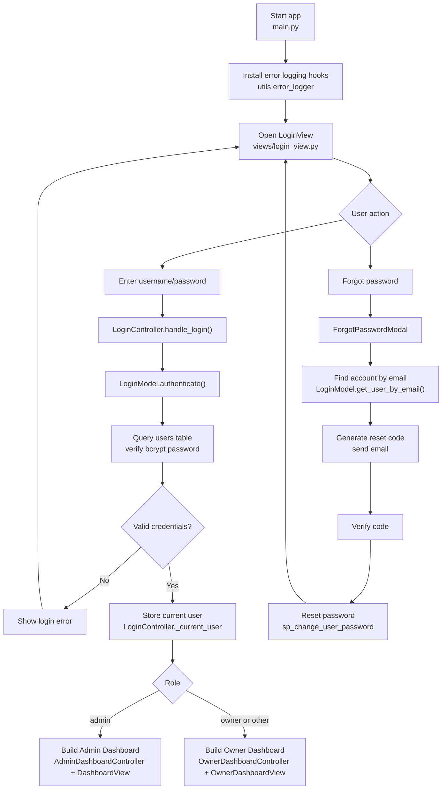
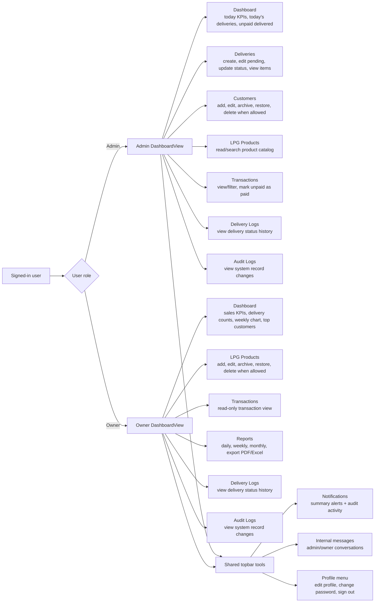
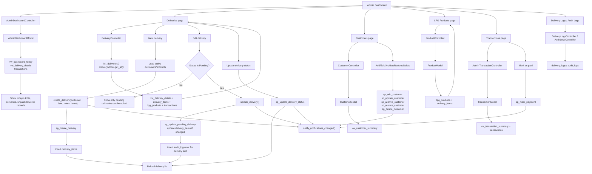
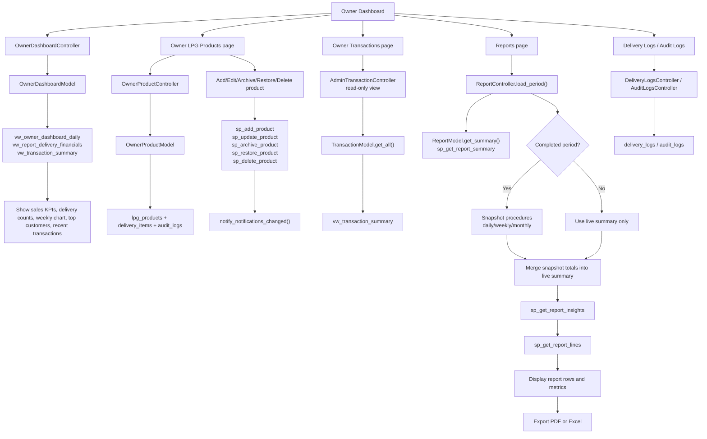
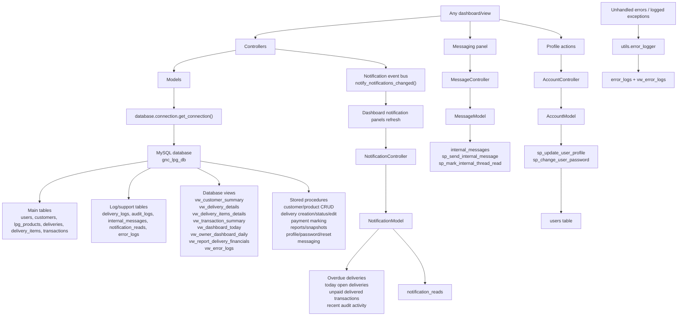

# G and C LPG Trading System Flowchart

This flowchart is based on the current Python code in this project. The app uses a PySide6 MVC-style structure:

- `views/` builds screens and handles user interaction.
- `controllers/` validate requests and coordinate view/model updates.
- `models/` read and write MySQL data through `database/connection.py`.
- Stored procedures and database views do much of the business/data work.

## 1. Whole System Entry Flow

## 2. Role-Based Navigation Flow

## 3. Admin Operational Workflow

## 4. Owner Management and Reporting Workflow

## 5. Shared Services and Data Layer

## Important Accuracy Notes

- The app starts at `main.py`, then `views/login_view.py`.
- Login is role-based: `admin` opens `DashboardView`; every other role path currently opens `OwnerDashboardView`.
- Admin can manage deliveries and customers. Admin product screen is currently read/search only.
- Owner can manage LPG products. Owner transaction screen is read-only.
- Transactions are read from `vw_transaction_summary`; marking payment uses `sp_mark_payment`.
- Reports use live stored procedure totals, then merge snapshot totals only for completed daily/weekly/monthly periods.
- Several side effects are handled in the database through stored procedures and likely database triggers/views. The Python code calls the procedures and then reloads the relevant views/tables.
